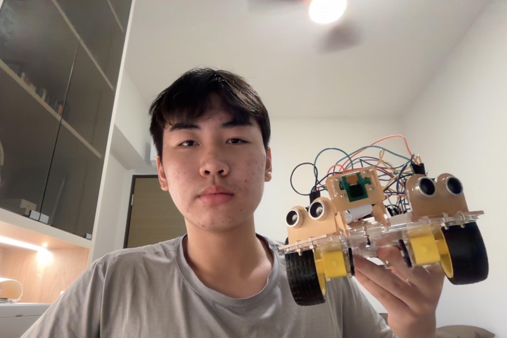
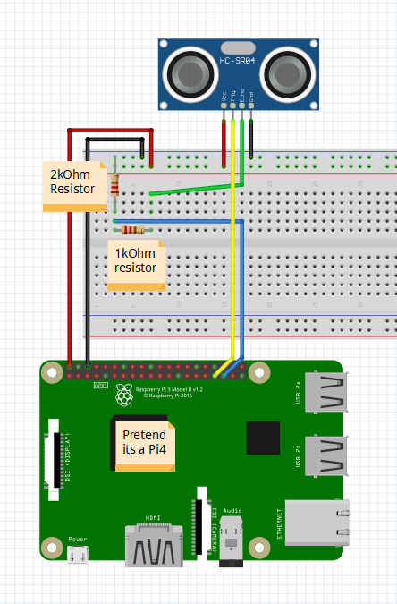
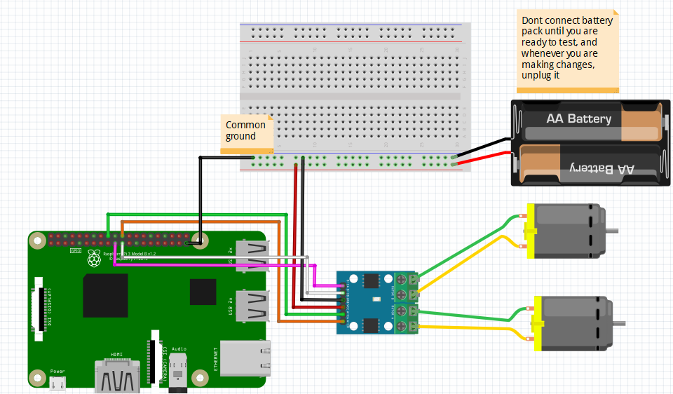

# Ball Tracking Robot
The ball tracking robot uses a Pi camera and an ultrasonic sensor to locate the ball. The robot uses motors to follow or intercept the ball while maintaining a set distance. The proportional control, wiring, and computer vision make it complex and challenging.

| **Engineer** | **School** | **Area of Interest** | **Grade** |
|:--:|:--:|:--:|:--:|
| Elian C | St. Joseph's Institution International  | Robotics and Computer Vision | Grade 9



  
# First Milestone

<iframe width="560" height="315" src="https://www.youtube.com/embed/3RR2q0Sp2D4?si=z95kCTO16c_35QIf" title="YouTube video player" frameborder="0" allow="accelerometer; autoplay; clipboard-write; encrypted-media; gyroscope; picture-in-picture; web-share" referrerpolicy="strict-origin-when-cross-origin" allowfullscreen></iframe>


## Technical Report

I utilised Raspberry Pi 4 as the vision processor to run Python code that processes the camera feed and sends GPIO signals to the H-Bridge to control the motors. Ultrasonic sensors measure the distance to the ball without making physical contact by emitting high-frequency sound waves. The ultrasonic sensor outputs 5V on the Echo pin, and the Raspberry Pi's GPIO pins are only 3.3V tolerant. Without the voltage divider, the 5V signal would damage the Pi's GPIO pins. The divider brings 5V down to 3.33V using 1KΩ and 2KΩ resistors, making it safe for the Pi. The voltage divider is working correctly, as evidenced by the ultrasonic sensors returning accurate distance readings without damaging the Pi's GPIO pins. I encountered the SSID error that prevented SSH connection. I resolved it by re-entering my Wi-Fi SSID. When I tried to SSH in the terminal, the connection was refused multiple times, and I reflashed the SD card repeatedly to resolve it. When I connected the H-Bridge and motor wires to the Pi and tested my motors, I found that my H-Bridge was overheating. The cause was subsequently identified as a missing common ground connection. My Pi camera module was confirmed faulty after multiple reseating attempts and power cycles. To resolve this, I purchased a new replacement. Next, I will control the motors using the H-Bridge, integrate the Pi camera when the replacement arrives, and track the ball.


## Code for the Ultrasonic Sensor Test

```python
import RPi.GPIO as GPIO
import time
GPIO.setmode(GPIO.BCM)
GPIO_TRIGGER1=5
GPIO_ECHO1=6
GPIO_TRIGGER3=16
GPIO_ECHO3=26
GPIO.setup(GPIO_TRIGGER1,GPIO.OUT)
GPIO.setup(GPIO_ECHO1,GPIO.IN)
GPIO.setup(GPIO_TRIGGER3,GPIO.OUT)
GPIO.setup(GPIO_ECHO3,GPIO.IN)
GPIO.output(GPIO_TRIGGER1,False)
GPIO.output(GPIO_TRIGGER3,False)
def sonar(GPIO_TRIGGER,GPIO_ECHO):
      start=0
      stop=0
      GPIO.setup(GPIO_TRIGGER,GPIO.OUT)
      GPIO.setup(GPIO_ECHO,GPIO.IN)
      GPIO.output(GPIO_TRIGGER,False)
      time.sleep(0.01)
      GPIO.output(GPIO_TRIGGER,True)
      time.sleep(0.00001)
      GPIO.output(GPIO_TRIGGER,False)
      begin=time.time()
      while GPIO.input(GPIO_ECHO)==0 and time.time()<begin+0.05:
            start=time.time()
      while GPIO.input(GPIO_ECHO)==1 and time.time()<begin+0.1:
            stop=time.time()
      elapsed=stop-start
      distance=elapsed*34000
      distance=distance/2
      print ("Distance: %.1f"%distance)
      return distance
while True:
      distanceR=sonar(GPIO_TRIGGER3,GPIO_ECHO3)
      distanceL=sonar(GPIO_TRIGGER1,GPIO_ECHO1)
      time.sleep(1)
GPIO.cleanup()
```


# Second Milestone

<iframe width="560" height="315" src="https://www.youtube.com/embed/wWM_3ryNEk0?si=eCjt4IS2Hsm3CGhY" title="YouTube video player" frameborder="0" allow="accelerometer; autoplay; clipboard-write; encrypted-media; gyroscope; picture-in-picture; web-share" referrerpolicy="strict-origin-when-cross-origin" allowfullscreen></iframe>


## Technical Report

I have successfully tested the motors in all directions and confirmed the Pi Camera is operational. I use an H-bridge to control the motors, with the Pi sending digital signals via its GPIO pins. The Pi camera detects red objects using image segmentation in HSV and YCrCb colour spaces to isolate red pixels and find contours for the ball's location. I faced several issues with motor connections, including a burnt H-bridge due to a lack of common ground. I resolved this by stripping the battery pack wire and replacing a faulty right motor and Pi camera. My next steps are to assemble and mount the components on the chassis and implement PID control.


## Code for the Pi Camera and Motors Test

Pi Camera Code:
```python
from picamera2 import Picamera2
import cv2
import numpy as np
import time
def segment_colour(frame):
    hsv_roi=cv2.cvtColor(frame,cv2.COLOR_BGR2HSV)
    mask_1=cv2.inRange(hsv_roi,np.array([160,160,10]),np.array([180,255,255]))
    ycr_roi=cv2.cvtColor(frame,cv2.COLOR_BGR2YCrCb)
    mask_2=cv2.inRange(ycr_roi, np.array((0.,165.,0.)),np.array((255., 255., 255.)))
    mask=mask_1|mask_2
    kern_dilate=np.ones((8,8),np.uint8)
    kern_erode=np.ones((3,3),np.uint8)
    mask=cv2.erode(mask,kern_erode)
    mask=cv2.dilate(mask,kern_dilate)
    return mask
def find_blob(blob):
    largest_contour=0
    cont_index=0
    contours,hierarchy=cv2.findContours(blob,cv2.RETR_CCOMP,cv2.CHAIN_APPROX_SIMPLE)
    for idx,contour in enumerate(contours):
        area=cv2.contourArea(contour)
        if (area>largest_contour):
            largest_contour=area
            cont_index=idx
    r=(0,0,2,2)
    if len(contours)>0:
        r=cv2.boundingRect(contours[cont_index])
    return r,largest_contour
camera=Picamera2()
config=camera.create_preview_configuration(main={"size": (160, 120), "format": "RGB888"})
camera.configure(config)
camera.start()
time.sleep(0.1)
while True:
    frame=camera.capture_array()
    frame=cv2.flip(frame, 1)
    mask_red=segment_colour(frame)
    loct,area=find_blob(mask_red)
    x,y,w,h=loct
    if (w*h)>=10:
        cv2.rectangle(frame,(x,y),(x+w,y+h),(0,255,0),2)
        centre_x=int(x+w/2)
        centre_y=int(y+h/2)
        cv2.circle(frame, (centre_x,centre_y),3,(0,110,255),-1)
        print("Ball found - area: %d centre:(%d, %d)" % (area, centre_x,centre_y))
    else:
        print("No ball found")
    cv2.imshow("Camera feed", frame)
    cv2.imshow("Red mask", mask_red)
    if cv2.waitKey(1)&0xff==ord('q'):
        break
camera.stop()
cv2.destroyAllWindows()
```

Motor Test Code:
```python
import RPi.GPIO as GPIO
import time
GPIO.setmode(GPIO.BCM)
MOTOR1A=22
MOTOR1B=27
MOTOR2A=24
MOTOR2B=23
GPIO.setup(MOTOR1A,GPIO.OUT)
GPIO.setup(MOTOR1B,GPIO.OUT)
GPIO.setup(MOTOR2A,GPIO.OUT)
GPIO.setup(MOTOR2B,GPIO.OUT)
def forward():
      GPIO.output(MOTOR1A,GPIO.HIGH)
      GPIO.output(MOTOR1B,GPIO.LOW)
      GPIO.output(MOTOR2A,GPIO.HIGH)
      GPIO.output(MOTOR2B,GPIO.LOW)
def reverse():
      GPIO.output(MOTOR1A,GPIO.LOW)
      GPIO.output(MOTOR1B,GPIO.HIGH)
      GPIO.output(MOTOR2A,GPIO.LOW)
      GPIO.output(MOTOR2B,GPIO.HIGH)
def rightturn():
      GPIO.output(MOTOR1A,GPIO.HIGH)
      GPIO.output(MOTOR1B,GPIO.LOW)
      GPIO.output(MOTOR2A,GPIO.LOW)
      GPIO.output(MOTOR2B,GPIO.HIGH)
def leftturn():
      GPIO.output(MOTOR1A,GPIO.LOW)
      GPIO.output(MOTOR1B,GPIO.HIGH)
      GPIO.output(MOTOR2A,GPIO.HIGH)
      GPIO.output(MOTOR2B,GPIO.LOW)
def stop():
      GPIO.output(MOTOR1A,GPIO.LOW)
      GPIO.output(MOTOR1B,GPIO.LOW)
      GPIO.output(MOTOR2A,GPIO.LOW)
      GPIO.output(MOTOR2B,GPIO.LOW)
print("Forward")     
forward()
time.sleep(3)
stop()
time.sleep(1)
print("Reverse")
reverse()
time.sleep(3)
stop()
time.sleep(1)
print("Right")
rightturn()
time.sleep(3)
stop()
time.sleep(1)
print("Left")
leftturn()
time.sleep(3)
stop()
GPIO.cleanup()
```


# Final Milestone

<iframe width="560" height="315" src="https://www.youtube.com/embed/G_yUzSXZdU4?si=G2knDzwRiztILe88" title="YouTube video player" frameborder="0" allow="accelerometer; autoplay; clipboard-write; encrypted-media; gyroscope; picture-in-picture; web-share" referrerpolicy="strict-origin-when-cross-origin" allowfullscreen></iframe>


## Technical Report**

I have integrated my camera, motors, and sensors' scripts to detect the ball's direction. Initially planning to use PID control, I opted for a simpler proportional control approach to meet the programme timeline. The tracking script detects the ball, calculates its position relative to the frame's centre, and directs the robot to turn towards it. I resolved issues with my Pi camera being mirrored by removing the flipping line and corrected the motors' direction by swapping the left-turn and right-turn functions. With more time, I'd implement PID control for smoother tracking and add multiple colour tracking for following different coloured balls.


## Code

```python
from picamera2 import Picamera2
import RPi.GPIO as GPIO
import time
import cv2
import numpy as np
GPIO.setmode(GPIO.BCM)
GPIO_TRIGGER1=5
GPIO_ECHO1=6
GPIO_TRIGGER3=16
GPIO_ECHO3=26
MOTOR1A=22
MOTOR1B=27
MOTOR2A=24
MOTOR2B=23
GPIO.setup(GPIO_TRIGGER1,GPIO.OUT)
GPIO.setup(GPIO_ECHO1,GPIO.IN)
GPIO.setup(GPIO_TRIGGER3,GPIO.OUT)
GPIO.setup(GPIO_ECHO3,GPIO.IN)
GPIO.output(GPIO_TRIGGER1,False)
GPIO.output(GPIO_TRIGGER3,False)
def sonar(GPIO_TRIGGER,GPIO_ECHO):
      start=0
      stop=0
      GPIO.setup(GPIO_TRIGGER,GPIO.OUT)
      GPIO.setup(GPIO_ECHO,GPIO.IN)
      GPIO.output(GPIO_TRIGGER,False)
      time.sleep(0.01)
      GPIO.output(GPIO_TRIGGER,True)
      time.sleep(0.00001)
      GPIO.output(GPIO_TRIGGER,False)
      begin=time.time()
      while GPIO.input(GPIO_ECHO)==0 and time.time()<begin+0.05:
            start=time.time()
      while GPIO.input(GPIO_ECHO)==1 and time.time()<begin+0.1:
            stop=time.time()
      elapsed=stop-start
      distance=elapsed*34000
      distance=distance/2
      print("Distance : %.1f" % distance)
      return distance
GPIO.setup(MOTOR1A,GPIO.OUT)
GPIO.setup(MOTOR1B,GPIO.OUT)
GPIO.setup(MOTOR2A,GPIO.OUT)
GPIO.setup(MOTOR2B,GPIO.OUT)
def forward():
      GPIO.output(MOTOR1A,GPIO.HIGH)
      GPIO.output(MOTOR1B,GPIO.LOW)
      GPIO.output(MOTOR2A,GPIO.HIGH)
      GPIO.output(MOTOR2B,GPIO.LOW)
def reverse():
      GPIO.output(MOTOR1A,GPIO.LOW)
      GPIO.output(MOTOR1B,GPIO.HIGH)
      GPIO.output(MOTOR2A,GPIO.LOW)
      GPIO.output(MOTOR2B,GPIO.HIGH)
def rightturn():
      GPIO.output(MOTOR1A,GPIO.HIGH)
      GPIO.output(MOTOR1B,GPIO.LOW)
      GPIO.output(MOTOR2A,GPIO.LOW)
      GPIO.output(MOTOR2B,GPIO.HIGH)
def leftturn():
      GPIO.output(MOTOR1A,GPIO.LOW)
      GPIO.output(MOTOR1B,GPIO.HIGH)
      GPIO.output(MOTOR2A,GPIO.HIGH)
      GPIO.output(MOTOR2B,GPIO.LOW)
def stop():
      GPIO.output(MOTOR1A,GPIO.LOW)
      GPIO.output(MOTOR1B,GPIO.LOW)
      GPIO.output(MOTOR2A,GPIO.LOW)
      GPIO.output(MOTOR2B,GPIO.LOW)
def segment_colour(frame):
    hsv_roi=cv2.cvtColor(frame,cv2.COLOR_BGR2HSV)
    mask_1=cv2.inRange(hsv_roi,np.array([160,160,10]),np.array([180,255,255]))
    ycr_roi=cv2.cvtColor(frame,cv2.COLOR_BGR2YCrCb)
    mask_2=cv2.inRange(ycr_roi,np.array((0.,165.,0.)), np.array((255.,255.,255.)))
    mask=mask_1|mask_2
    kern_dilate=np.ones((8,8),np.uint8)
    kern_erode =np.ones((3,3),np.uint8)
    mask=cv2.erode(mask,kern_erode)
    mask=cv2.dilate(mask,kern_dilate)
    return mask
def find_blob(blob):
    largest_contour=0
    cont_index=0
    contours,hierarchy=cv2.findContours(blob,cv2.RETR_CCOMP,cv2.CHAIN_APPROX_SIMPLE)
    for idx, contour in enumerate(contours):
        area=cv2.contourArea(contour)
        if (area>largest_contour):
            largest_contour=area
            cont_index=idx
    r=(0,0,2,2)
    if len(contours)>0:
        r=cv2.boundingRect(contours[cont_index])
    return r,largest_contour
def target_hist(frame):
    hsv_img=cv2.cvtColor(frame,cv2.COLOR_BGR2HSV)
    hist=cv2.calcHist([hsv_img],[0],None,[50],[0,255])
    return hist
camera=Picamera2()
config=camera.create_preview_configuration(main={"size": (160,120), "format": "RGB888"})
camera.configure(config)
camera.start()
time.sleep(0.1)
flag=0
while True:
      frame=camera.capture_array()
      frame=cv2.flip(frame,1)
      centre_x=0.
      centre_y=0.
      mask_red=segment_colour(frame)
      loct,area=find_blob(mask_red)
      x,y,w,h=loct
      distanceR=sonar(GPIO_TRIGGER3,GPIO_ECHO3)
      distanceL=sonar(GPIO_TRIGGER1,GPIO_ECHO1)
      if (w*h)<10:
            found=0
      else:
            found=1
            simg2=cv2.rectangle(frame,(x,y),(x+w,y+h),255,2)
            centre_x=x+((w)/2)
            centre_y=y+((h)/2)
            cv2.circle(frame,(int(centre_x),int(centre_y)),3,(0,110,255),-1)
            centre_x-=80
            centre_y=60-centre_y
            print(centre_x,centre_y)
      initial=2500
      if(found==0):
            if flag==0:
                  rightturn()
                  time.sleep(0.05)
            else:
                  leftturn()
                  time.sleep(0.05)
            stop()
            time.sleep(0.0125)
      elif(found==1):
            if(area<initial):
                  if(distanceR<10 or distanceL<10):
                        if distanceR>=8:
                              rightturn()
                              time.sleep(0.00625)
                              stop()
                              time.sleep(0.0125)
                              forward()
                              time.sleep(0.00625)
                              stop()
                              time.sleep(0.0125)
                              leftturn()
                              time.sleep(0.00625)
                        elif distanceL>=8:
                              leftturn()
                              time.sleep(0.00625)
                              stop()
                              time.sleep(0.0125)
                              forward()
                              time.sleep(0.00625)
                              stop()    
                              time.sleep(0.0125)
                              rightturn()
                              time.sleep(0.00625)
                              stop()
                              time.sleep(0.0125)
                        else:
                              stop()
                              time.sleep(0.01)
                  else:
                        forward()
                        time.sleep(0.00625)
            elif(area>=initial):
                  initial2=6700
                  if(area<initial2):
                        if(distanceR>10 and distanceL>10):
                              if(centre_x<=-20 or centre_x>=20):
                                    if(centre_x<0):
                                          flag=1
                                          leftturn()
                                          time.sleep(0.025)
                                    elif(centre_x>0):
                                          flag=0
                                          rightturn()
                                          time.sleep(0.025)
                              forward()
                              time.sleep(0.00003125)
                              stop()
                              time.sleep(0.00625)
                        else:
                              stop()
                              time.sleep(0.01)
                  else:
                        time.sleep(0.1)
                        stop()
                        time.sleep(0.1)
      cv2.imshow("Camera feed",frame)
      cv2.imshow("Red mask",mask_red)
      if(cv2.waitKey(1)&0xff==ord('q')):
            break
camera.stop()
cv2.destroyAllWindows()
GPIO.cleanup()
```


# Schematics 




*Note: Schematics are based on a reference design. Pin assignments and component placement have been adapted to match this project's specific wiring configuration.*


 
# Bill of Materials

| **Part** | **Note** | **Price** | **Link** |
|:--:|:--:|:--:|:--:|
| Screwdriver | Assembling the robot chassis | $20.27 | <a href="https://www.amazon.sg/dp/B0BBFJ2XKY?ref=ppx_yo2ov_dt_b_fed_asin_title"> Link </a> |
| H-Bridge Motor Drive | Controls the direction and speed of the DC Motors | $20.51 | <a href="https://www.amazon.sg/VKLSVAN-Channel-H-Bridge-Stepper-Controller/dp/B0DQPRDHSK/ref=sr_1_1?crid=Y8BXRSLRBPA2&dib=eyJ2IjoiMSJ9.N12Bqdf_2P8Sg-7hcxYlDFdt5Z4RdXTwKJO_O8gKZyxiHskn-fX8uaW0cgysQlNzSFdROvS8e3FcUe0l00L2-5dAW1d-Rlnw-cVgMJMF-gQlFt_OYgWtLGY7JOvS8YMSjqQ5XiUUDvqhGPtj-Z0rl4iCA0UL3GTLccxvOxph2dm8asICSbQS_waohnQv3jnLPt4Em2QdC7mOdPrb3AZmzTr8uudnXNQxHyM12Qb7HFkpzrYUDLJvCNcm4GpfMWZuPCzbj4U5sMbTd0MenIPGtimoEHj_3oT4jnWfwy3ha9I.yukHYovBVQjkpeKhMBX20XnFG99hJxHm1T11Qm8Gbb4&dib_tag=se&keywords=H-bridge&qid=1782927562&sprefix=h-bri%2Caps%2C278&sr=8-1&th=1"> Link </a> |
| Raspberry Pi 4 | Runs the Python code that processes the camera feed and sends GPIO signals to the H-Bridge to control the motors | $216.27 | <a href="https://www.amazon.sg/dp/B0C8LV6VNZ?ref=ppx_yo2ov_dt_b_fed_asin_title"> Link </a> |
| Multimeter | Checks the voltage of wires to prevent short circuit | $25.99 | <a href="https://www.amazon.sg/dp/B01ISAMUA6?ref=ppx_yo2ov_dt_b_fed_asin_title"> Link </a> |
| Ultrasonic Sensor | Measures the distance to the ball | $25.35 | <a href="https://www.amazon.sg/dp/B0CQCCGXCP?ref=ppx_yo2ov_dt_b_fed_asin_title"> Link </a> |
| Chassis Kit | Provides the physical framework to mount and support all components including wheels and the Raspberry Pi | $24.32 | <a href="https://www.amazon.sg/dp/B01LXY7CM3?ref=ppx_yo2ov_dt_b_fed_asin_title"> Link </a> |
| Pi Camera | Captures the live video feed, which the code then processes to detect the ball's colour and calculate its position relative to the centre of the frame | $24.45 | <a href="https://www.amazon.sg/dp/B07RWCGX5K?ref=ppx_yo2ov_dt_b_fed_asin_title&th=1"> Link </a> |
| Batteries | Provides power for the motors| $29.86 | <a href="https://www.amazon.sg/dp/B0035LCFNQ?ref=ppx_yo2ov_dt_b_fed_asin_title&th=1"> Link </a> |
| Motor Dual DC | Drives the wheels under the control of the H-Bridge | $19.80 | <a href="https://www.amazon.sg/dp/B09N6NXP4H?ref=ppx_yo2ov_dt_b_fed_asin_title"> Link </a> |
| Foam Ball | The target object that the robot tracks and intercepts | $12.95 | <a href="https://www.amazon.sg/dp/B000KYQ406?ref=ppx_yo2ov_dt_b_fed_asin_title"> Link </a> |
| Electronics Kit | Provides the breadboard and jumper wires to connect components such as the H-Bridge, ultrasonic sensors, and motors | $9.99 | <a href="https://www.amazon.com/dp/B01ERP6WL4?ref=ppx_yo2ov_dt_b_fed_asin_title"> Link </a> |


# Other Resources/Examples

- https://www.instructables.com/Ball-Tracking-Robot

